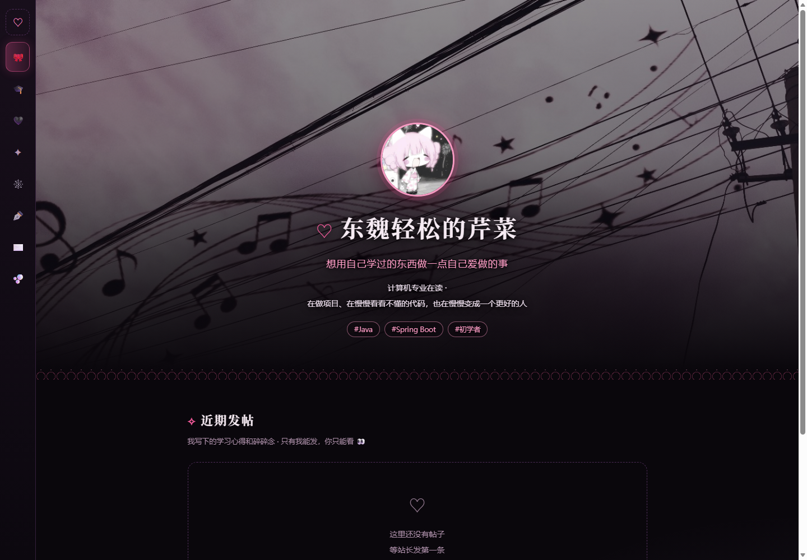

# 东魏轻松的芹菜的个人小站

个人网站 —— 左侧导航切换页面，内容存在数据库里：**访客只读，站长可写**。
原生 HTML/CSS/JS 前端 + Spring Boot / MySQL 后端，写接口由令牌统一鉴权。

在线地址：**https://xiaoxian33.github.io**

## 截图

## 技术栈

| 层 | 技术 |
|---|---|
| 前端 | 原生 HTML / CSS / JavaScript（无框架），托管于 GitHub Pages |
| 后端 | Java 21 · Spring Boot · Spring Data JPA (Hibernate) |
| 数据库 | MySQL 8 |
| 鉴权 | BCrypt 密码哈希 + Bearer 令牌；写接口统一挂 `/api/admin/**`，由拦截器一次鉴权 |

## 功能

- 随笔 / 发帖 / 个人资料的展示（读接口公开）
- 站长在页面内完成增删改：发帖、改帖、删帖、写随笔、改随笔、删随笔、改资料
- 图片上传：帖子与随笔都能配多张图，支持预览与删除

## 接口

| 方法 | 路径 | 权限 |
|---|---|---|
| `GET` | `/api/essays` · `/api/profile` · `/api/posts` | 公开 |
| `POST` | `/api/login` · `/api/logout` · `/api/admin/whoami` | 站长 |
| `POST` / `PUT` / `DELETE` | `/api/admin/essays{/id}` · `/api/admin/posts{/id}` · `/api/admin/profile` | 站长 |
| `POST` | `/api/admin/uploads` | 站长（图片上传） |

字段名、类型与失败码见 [docs/API.md](docs/API.md)；`/uploads/**` 为公开的图片访问路径。

## 本地运行

前置：JDK 21、MySQL 8。

1. 在 `server/src/main/resources/application-local.properties` 里填数据库密码与站长密码（该文件已被 `.gitignore` 排除）
2. 启动后端：`cd server && ./mvnw spring-boot:run`（Windows：`.\mvnw.cmd spring-boot:run`），或双击根目录的 `start-backend.bat`
3. 打开 `index.html`（纯静态页面，需后端运行在 `localhost:8080`）

首次启动会自动建表。站长入口：同时按住 `↑` 和 `←`。

## 目录结构

    index.html                所有页面（用 #锚点 切换）
    assets/                   css / js / 图片
    server/                   Spring Boot 后端
      └ src/main/java/com/xiaoxian33/site/
          实体 → 仓库 → 读接口 → 写接口 → 鉴权三件套 → 上传
    docs/API.md               接口契约：要什么字段、还什么字段、什么时候失败
    docs/STRUCTURE.md         每个文件管什么（一页看完）

个人项目，有意保持简单：不用前端框架，不堆组件。
安全边界在后端 —— 前端只负责把密码发给 `/api/login`、把令牌存进 `localStorage`；改前端变量无法写入数据库。
